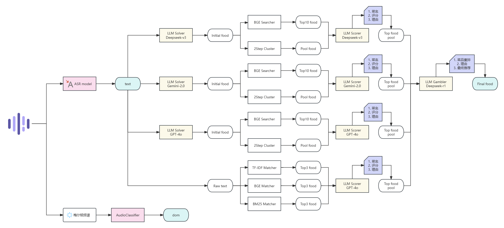
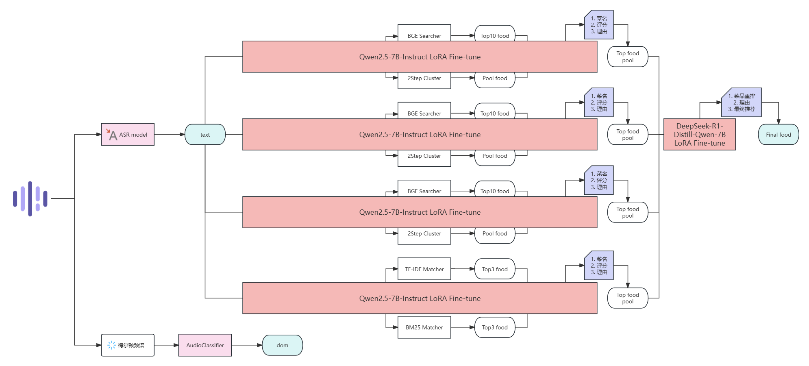

# 2025天池ELE AI算法大赛赛道一
队伍: ele is all u need  
队员: 顾国勤、郭子淳、赵亮节、熊润  
A榜排名: 22（A榜只提交了部分结果，完整结果得分为0.9644，排名第2）  
B榜排名: 2（得分为0.9647）  
复赛排名: 2

# 最终方案
语音转写部分，使用FunASR微调SenceVoice-small，通过五折交叉验证制作模型汤；意图识别部分，将音频处理成梅尔顿频谱，使用EfficientNet模型对频谱图进行分类；菜品推荐部分，设计四路召回，利用统计+语义的方式检索菜品，每一路的推荐各有侧重，基于模型最终的重排结果进行小模型蒸馏以实现本地部署。 
> `solution presentation.pdf`为我们的答辩ppt，项目搭建较为仓促，有诸多不足有待完善，感谢批评指正。

# 整体思路
  
*图1：整体思路-模型打标*

# 整体思路
  
*图2：整体思路-本地部署*

# 仓库结构

| 目录/文件           | 描述                                                                 |
|--------------------|----------------------------------------------------------------------|
| checkpoint/        | 存放所有模型：包括训练好的模型和预训练模型                               |
| data/              | 存放数据集：包含智慧养老_label/、A_audio/、train_audio/                 |
| **model/           | 存放模型代码：例如FireRedASR/、EfficientNet/，包含模型的训练和推理脚本    |
| result/            | 存放单步结果：是**.py的输出结果                                         |
| sub/               | 存放提交文件：整合单步结果，是sub.ipynb的输出结果                        |
| **.py              | 主目录下的py文件：例如fireredaed.py、efficientnet.py，引用model/中的训练和推理接口，方便后续整合成一条链路 |
| app.py             | 启动完整服务链路   |

# 实验记录
## A榜
| 提交文件                                              |   text   |   dom    |   food   |   总分   | 描述                                          |
|   -----------------------------------------------    | -------- | -------- | -------- | -------- |  ------------------------------------------- |
| 0409-only_dom_by_effnet                          |          |  0.2998  |          |  0.2998  | 五折EfficientNetB0                            |
| 0410-cancel-text_by_fireAED-dom_by_effnet        |  0.3758  |  0.2998  |          |  0.6756  | 没有修改多通道bug的FireRedASR-AED(1B)          |
| 0410-text_by_fireAED-dom_by_effnet               |  0.4342  |  0.2998  |          |  0.7340  | 修改多通道bug的FireRedASR-AED(1B)              |
| 0410-text_by_fireLLM-dom_by_effnet               |  0.4379  |  0.2998  |          |  0.7377  | 修改多通道bug的FireRedASR-LLM(8B)              |
| 0412-text_by_sensevoice_loss_none_gzc-dom_by_effnet |  0.4831  |  0.2998  |          | 0.7829 | 训练后的SenseVoice                           |
| 0413-text_by_sensevoice-dom_by_effnet-food_by_qwen  |  0.4831  |  0.2998  |  0.1648  | 0.9477 | qwen-14B菜品解析+库函数相似度召回              |
| 0425-text_by_sv1fold-dom_by_effnet-food_by_cluster+query |  0.4831  |  0.2998  |  0.1711  | 0.9540 | 聚类+deepseek-chooser                   |
| 0425-text_by_sv1fold-dom_by_effnet-food_by_cluster1+2+query |  0.4831  |  0.2998  |  0.1731  | 0.9560 | 1+2融合聚类+deepseek-chooser         |
| 0425-text_by_sv1fold-dom_by_effnet-food_by_ds-solver_bge-searcher-top1 |  0.4831  |  0.2998  |  0.1705  | 0.9534 | deepseek-solver+bge-searcher     |
| 0430-text_by_fireredaed_exp5.1  | 0.4706 |        | | | 微调FireRedASR-AED |
| 0506-text-sensevoice_avg_15 | 0.4827 | 0.2998 | | | 加长sma |
| 0507-text-sensevoice_modelsoup | 0.4840 | 0.2998 | | | 模型汤 |
| 0508-text_by_modelsoup-dom_by_effnet-food_by_slover-ds+cluster-1.1_1.2+searcher-bge+chooser-ds | 0.4840 | 0.2998 | 0.1779 | 0.9617 | cluster&searcher取并集 |
| 0509-text_by_modelsoup-dom_by_effnet-food_by_slover-ds_gemini+cluster-1.1_1.2+searcher-bge+chooser-ds | 0.4840 | 0.2998 | 0.1788 | 0.9626 | ds+gemini slover |
| 0509-text_by_modelsoup-dom_by_effnet-food_by_matcher-3ensemble-top3+chooser-ds | 0.4840 | 0.2998 | 0.1737 | 0.9575 | TF-IDF+BM25+BGE Matcher |
| 0509-text_by_modelsoup-dom_by_effnet-food_by_gambler-final_one_from_two+chooser-ds | 0.4840 | 0.2998 | 0.1796 | 0.9634 | choice out of two |
| 0510-text_by_modelsoup-dom_by_effnet-food_by_gambler-final_one_from_three+chooser-ds | 0.4840 | 0.2998 | 0.1806 | 0.9644 | choice out of three |

## B榜
| 提交文件                                              |   text   |   dom    |   food   |   总分   | 描述                                         |
|   -----------------------------------------------    | -------- | -------- | -------- | -------- |  ------------------------------------------ |
| 0512-text_by_modelsoup                               |  0.4827  |          |          |  0.4827  | SenseVoice模型汤                             |
| 0513-text_by_modelsoup-dom_by_effnet-food_by_gambler-final_one_from_three+chooser-ds | 0.4827 | 0.2998 | 0.1800 | 0.9625 | choice out of three |
| 0514-text_by_modelsoup-dom_by_effnet-food_by_gambler-final_one_from_four+chooser-ds  | 0.4827 | 0.2998 | 0.1808 | 0.9633 | choice out of four  |
| 0515-text_by_modelsoup-dom_by_effnet-food_by_gambler-final_one_from_four+chooser-ds+postprocess  | 0.4827 | 0.2998 | 0.1812 | 0.9637 | add postprocess -> version1 **best**     |
| 0516-text_by_modelsoup-dom_by_effnet-food_by_gambler-final_one_from_four+chooser-r1+postprocess  | 0.4827 | 0.3000 | 0.1820 | 0.9647 | from 1 chooser to score chooser -> version2 **best**  |

# 模型仓库
Modelscope：**GuoqinGu/tianchi-ele2025-track1**  

# 推荐链路
- `python app.py`  

# 逐步实现
## 环境安装
- `conda create -n ele python=3.11`、`pip install -r requirements.txt`
## 模型下载
- `python download.py`（需要手动设置需要下载的模型名称，已经给出注释提示）  
## api key设置  
- 在`src/key.json`中设置自己的api key  

## 语音转写
> 具体实现请查看task1文件夹  

## 意图识别
1. EfficientNet的数据处理：执行`python efficientnet.py -s Process -d {}`  
2. EfficientNet的训练（五折交叉验证）：执行`python efficientnet.py -s Train -d {}`   
> 训练好的efficientnet模型可以从modelscope仓库获取  
3. EfficientNet的推理：执行`python efficientnet.py -s Inference -d {}`  

## 菜品推荐（调用api，如图1所示）
> 通用参数说明：
> - `-n`：方法名称；
> - `-s`：步骤名称；
> - `-d`：choices=['T', 'A', 'B']，分别代表训练集、A榜测试集和B榜测试集 
> - `-l`：choices=['ds', 'gemini', 'gpt', 'r1']，指定进行api请求的大模型名称
### LLM Slover
**请注意网络问题，提交模型请求的py文件中设置了代理。** 
1. 生成query文件：执行`python Commender/create_query_solver.py -n asr-modelsoup -d {}`  
   得到query文件（*results_{}/Commender/query/asr-modelsoup+solver-ds_0.jsonl*、*results_{}/Commender/query/asr-modelsoup+solver-gemini_0.jsonl*、*results_{}/Commender/query/asr-modelsoup+solver-gpt_0.jsonl*） 
2. deepseek Slover：对用户语音进行初始推荐，执行`python Commender/batch_query.py -n asr-modelsoup+solver-ds -l ds -d {}`  
   得到结果文件（*results_{}/Commender/query/asr-modelsoup+solver-ds_0_output.jsonl*）  
3. gemini Slover：对用户语音进行初始推荐，执行`python Commender/flow_query.py -n asr-modelsoup+solver-gemini -l gemini -d {}`  
   得到结果文件（*results_{}/Commender/query/asr-modelsoup+solver-gemini_0_output.jsonl*）。 
4. gpt Slover：对用户语音进行初始推荐，执行`python Commender/flow_query.py -n asr-modelsoup+solver-gpt -l gpt -d {}`（也可以batch query，不过时间较久）  
   得到结果文件（*results_{}/Commender/query/asr-modelsoup+solver-gpt_0_output.jsonl*）  
### Commender & LLM Chooser
> 训练好的聚类模型可以从modelscope仓库获取  
1. Commender：基于Slover结果推荐菜品池，执行`python commend.py -s Commender -d {}`  
   得到包含food_pool的commend文件（*results_{}/Commender/slover-ds+cluster-1.1_1.2+searcher-bge.csv*、*results_{}/Commender/slover-gemini+cluster-1.1_1.2+searcher-bge.csv*、*results_{}/Commender/slover-gpt+cluster-1.1_1.2+searcher-bge.csv*）  
2. 生成query文件：执行`python Commender/create_query_chooser.py -n slover-ds+cluster-1.1_1.2+searcher-bge -l ds -d {}`、`python Commender/create_query_chooser.py -n slover-gemini+cluster-1.1_1.2+searcher-bge -l gemini -d {}`、`python Commender/create_query_chooser.py -n slover-gpt+cluster-1.1_1.2+searcher-bge -l gpt -d {}`  
   得到query文件（*results_{}/Commender/query/slover-ds+cluster-1.1_1.2+searcher-bge_0.jsonl*、*results_{}/Commender/query/slover-gemini+cluster-1.1_1.2+searcher-bge_0.jsonl*、*results_{}/Commender/query/slover-gpt+cluster-1.1_1.2+searcher-bge_0.jsonl*）  
3. Chooser：对推荐结果进行打分，执行`python Commender/batch_query.py -n slover-ds+cluster-1.1_1.2+searcher-bge -l ds -d {}`、`python Commender/flow_query.py -n slover-gemini+cluster-1.1_1.2+searcher-bge -l gemini -d {}`、`python Commender/flow_query.py -n slover-gpt+cluster-1.1_1.2+searcher-bge -l gpt -d {}`  
   得到结果文件（*results_{}/Commender/query/slover-ds+cluster-1.1_1.2+searcher-bge_0_output.jsonl*、*results_{}/Commender/slover-gemini+cluster-1.1_1.2+searcher-bge_0_output.jsonl*、*results_{}/Commender/slover-gpt+cluster-1.1_1.2+searcher-bge_0_output.jsonl*）  
4. 生成打分结果：执行`python commend.py -s LLMChooser -d {}`  
   得到结果文件（*results_{}/Commender/slover-ds+cluster-1.1_1.2+searcher-bge+chooser-ds.csv*、*results_{}/Commender/slover-gemini+cluster-1.1_1.2+searcher-bge+chooser-gemini.csv*、*results_{}/Commender/slover-gpt+cluster-1.1_1.2+searcher-bge+chooser-gpt.csv*）  
### Matcher & LLM Chooser
1. Matcher：基于原始text进行词频和语义层面的匹配，执行`python match.py -s Matcher -d {}`  
   得到包含food_pool的match文件（*results_{}/Commender/matcher-3ensemble-top3.csv*）  
2. 生成query文件：执行`python Commender/create_query_chooser.py -n matcher-3ensemble-top3 -l gpt -d {}`  
   得到query文件（*results_{}/Commender/query/matcher-3ensemble-top3_0.jsonl*）
3. Chooser（flow query）：对推荐结果进行打分，执行`python Commender/flow_query.py -n matcher-3ensemble-top3 -l gpt -d {}`  
   得到结果文件（*results_{}/Commender/query/matcher-3ensemble-top3_0_output.jsonl*）  
4. 生成打分结果：执行`python match.py -s LLMChooser -d {}`  
   得到结果文件（*results_{}/Commender/matcher-3ensemble-top3+chooser-gpt.csv*）  
### Final LLM Gambler:
1. Gambler: 基于四路结果进行最终推荐，执行`python gamble.py -s Gambler -d {}`  
   得到包含food_pool的gamble文件（*results_{}/Commender/gambler-final_one_from_four.csv*）  
2. 生成query文件：执行`python Commender/create_query_gambler.py -n gambler-final_one_from_four -l r1 -d {}`  
   得到query文件（*results_{}/Commender/query/gambler-final_one_from_four_0.jsonl*）
3. Gambler（batch query）：进行排序和最终选择，执行`python Commender/batch_query.py -n gambler-final_one_from_four -l ds -d {}`  
   得到结果文件（*results_{}/Commender/query/gambler-final_one_from_four_0_output.jsonl*）  
4. 生成排序结果：执行`python gamble.py -s LLMChooser -d {}`  
   得到对第一、二、三、四路召回pool的排序结果（*results_{}/Commender/gambler-final_one_from_four+chooser-dsr1.csv*）  
## 结果生成
生成sub文件：执行`python sub.py` 

## 菜品推荐（LoRA微调，如图2所示）
### 微调数据集生成
1. 基于api调用的结果构造数据集。（如已经准备好数据集，则跳过）  
- `python Commender/make_dataset_for_chooser.py -n slover-ds+cluster-1.1_1.2+searcher-bge -c solver-chooser-ds -d {}`  
- `python Commender/make_dataset_for_chooser.py -n slover-gemini+cluster-1.1_1.2+searcher-bge -c solver-chooser-gemini -d {}`  
- `python Commender/make_dataset_for_chooser.py -n slover-gpt+cluster-1.1_1.2+searcher-bge -c solver-chooser-gpt -d {}`  
- `python Commender/make_dataset_for_chooser.py -n matcher-3ensemble-top3 -c matcher-chooser-gpt -d {}`  
- `python Commender/make_dataset_for_gambler.py -n gambler-final_one_from_four -c gambler -d {}`  
### 微调
> 如果要进行训练，请使用`download.py`下载Qwen2.5-7B-Instruct和DeepSeek-R1-Distill-Qwen-7B  
1. 训练模型并保存LoRA权重（训练['solver-chooser-ds', 'solver-chooser-gemini', 'solver-chooser-gpt', 'matcher-chooser-gpt', 'gambler']）。
- `python Commender/finetune.py -o solver-chooser-ds --method Lora --per_device_train_batch_size 8 --gradient_accumulation_steps 4`  
- `python Commender/finetune.py -o solver-chooser-gemini --method Lora --per_device_train_batch_size 8 --gradient_accumulation_steps 4`  
- `python Commender/finetune.py -o solver-chooser-gpt --method Lora --per_device_train_batch_size 8 --gradient_accumulation_steps 4`  
- `python Commender/finetune.py -o matcher-chooser-gpt --method Lora --per_device_train_batch_size 8 --gradient_accumulation_steps 4`  
- `python Commender/finetune.py -o gambler --method Lora --per_device_train_batch_size 4 --gradient_accumulation_steps 2`  
2. 训练端到端模型（训练['end-2-end']）
- `python Commender/finetune.py -o end-2-end --n_epoch 1 --per_device_train_batch_size 64`
- `python Commender/finetune.py -o end-2-end-large --method LP --n_epoch 1 --per_device_train_batch_size 24`
> 训练好的LoRA权重和模型权重可以从modelscope仓库获取
### 推理
- `python Commender/inference.py -o solver-chooser-ds --method Lora -c 750 -d B`  
- `python Commender/inference.py -o solver-chooser-gemini --method Lora -c 750 -d B`  
- `python Commender/inference.py -o solver-chooser-gpt --method Lora -c 750 -d B`  
- `python Commender/inference.py -o matcher-chooser-gpt --method Lora -c 750 -d B`  
- `python Commender/lora_reasoning_model_inference.py.py -o gambler -c 750 -d B --method Lora -i`：可以选择是否启用LoRA权重，以及是否进行本地推理
> 对于gambler，也可以使用flow query调用r1进行回答获得更好效果，只需要关闭参数`-i`，获得输出文件后使用执行`python create_query_gambler.py -n gambler-lora_results -l r1 -d {}`、`python batch_query.py -n gambler-lora_results -l ds -d {}`和`python gamble.py -n gambler-lora_results -s LLMChooser -d {}`
- `python Commender/inference.py -o end-2-end -c 125 -d B`：端到端小模型推理
